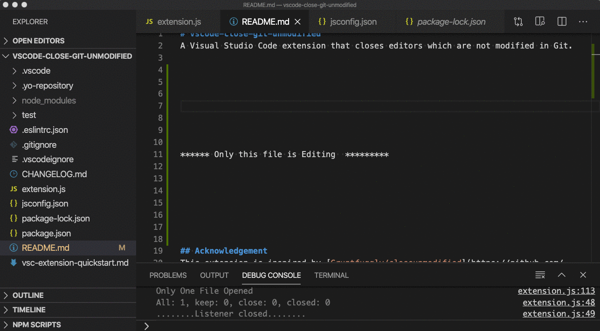

# vscode-close-git-unmodified
A Visual Studio Code extension that closes editors which are not modified in Git. Created by [cyanhall.com](https://www.cyanhall.com/)

## Acknowledgement
This extension is inspired by [Gruntfuggly/closeunmodified](https://github.com/Gruntfuggly/closeunmodified)

## Screenshot


## Installing
You can install the latest version of the extension via the Visual Studio Marketplace [here](https://marketplace.visualstudio.com/items?itemName=Cyanhall.close-git-unmodified).

Alternatively, open Visual Studio code, press `Ctrl/Cmd+P` and type:
```sh
> ext install close-git-unmodified
```

## Operation
Open the Command Palette (`Cmd/Ctrl` + `Shift` + `P`), and entry `Close Git Unmodified`.

### 1.0.0
Initial release.

## Source Code
The source code is available on GitHub [here](https://github.com/JeOam/vscode-close-git-unmodified).